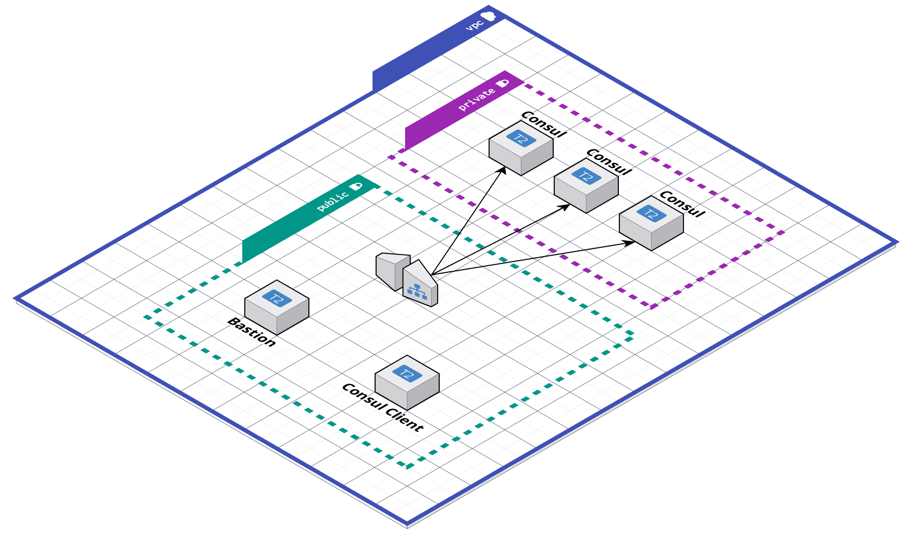

This is a simple Terraform project to start an AWS environment with HashiCorp Consul installed and running.



# Usage

To use this project you must set the below mandatory variables and create a Key Pair in your AWS account.

## Mandatory Variables

The following variables have no default nad must be declared in a terraform.tfvars file or via the CLI

- instance_key_name
- project_name
- ssh_cidr_allow

## Start Environment

```
terraform init
terraform apply
```

## Connect to Consul Servers through bastion

`terraform output` will list the public ip of the bastion host and private ips of Consul servers.

`ssh -A ubuntu@<public_ip_bastion>` to connect to the bastion server
`ssh ubuntu@<private_ip_consul>` to connect to a consul server
